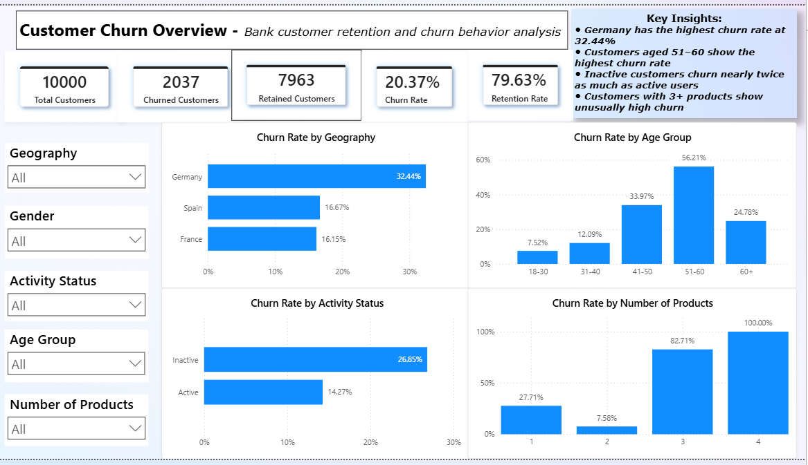
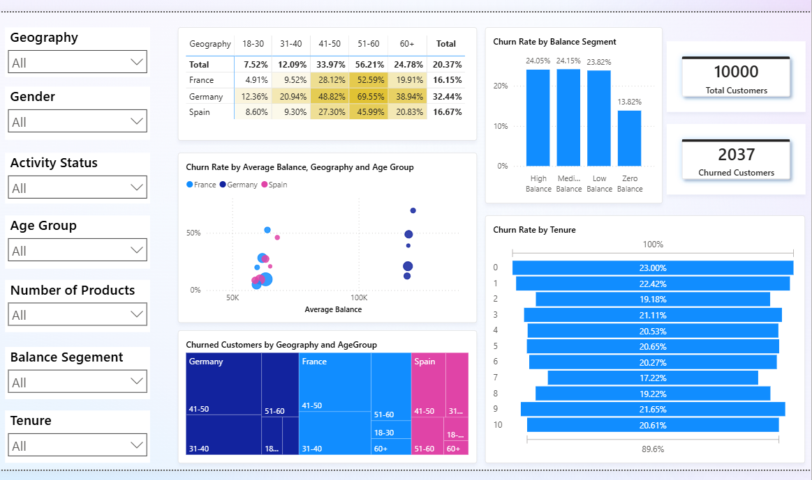
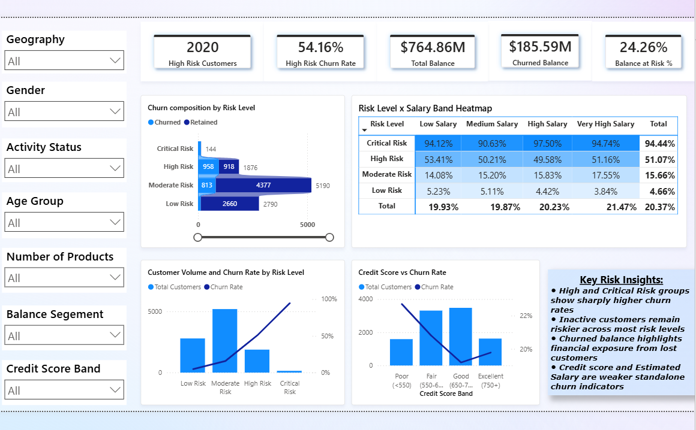
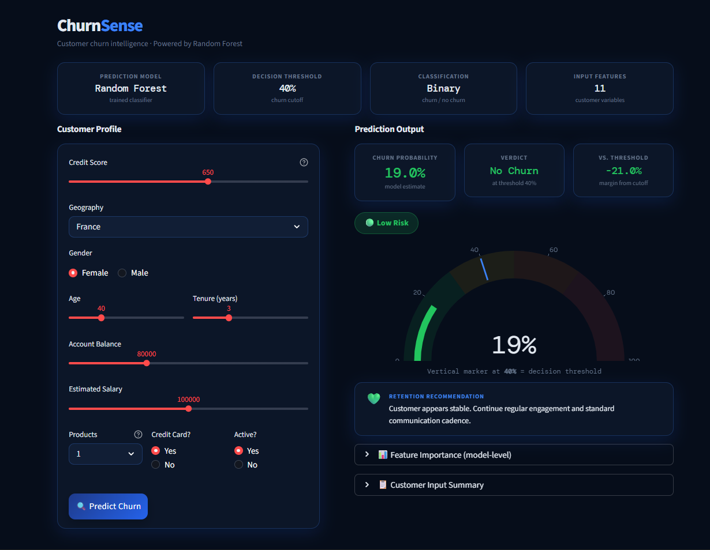

# ChurnSense

End-to-end customer churn prediction and retention analytics project using Python, SQL, Power BI, Machine Learning, FastAPI, and Streamlit.

## Project Overview

This project analyzes bank customer churn behavior and builds a machine learning-based churn prediction system. The goal is to identify key churn drivers, segment high-risk customers, visualize business insights through Power BI, and provide an interactive web app for individual customer churn prediction.

## Objectives

- Analyze customer churn patterns using Python and SQL
- Identify major churn drivers through exploratory data analysis
- Build and evaluate machine learning models for churn prediction
- Create an interactive Power BI dashboard for business insights
- Develop a Streamlit web app for customer-level churn prediction
- Provide retention recommendations based on churn risk level

## Tools and Technologies

- Python
- Pandas, NumPy
- Matplotlib, Seaborn
- Scikit-learn
- MySQL
- Power BI
- FastAPI
- Streamlit
- Plotly

## Project Workflow

1. Data cleaning and preprocessing
2. Exploratory data analysis
3. SQL-based churn analysis
4. Machine learning model training and evaluation
5. Threshold tuning and final model selection
6. Power BI dashboard creation
7. Streamlit web app development

## Key Insights

- Overall customer churn rate was approximately 20.37%.
- Germany showed the highest churn rate among all regions.
- Inactive customers churned at a much higher rate than active customers.
- Customers aged 51–60 showed the highest churn tendency.
- Customers with more than two products showed unusually high churn rates.
- Medium-to-high balance customers showed elevated churn risk.
- Credit score and estimated salary were weaker standalone churn indicators.

## Machine Learning Summary

Multiple models were trained and compared, including Logistic Regression, Balanced Logistic Regression, Random Forest, and XGBoost.

The final operational model selected was:

**Random Forest Classifier with a 0.4 decision threshold**

This model provided the best practical tradeoff between precision, recall, and F1-score for churn detection.

## Power BI Dashboard

### Churn Overview

### Customer Segmentation Analysis

### Risk and Retention Analysis

## Streamlit Web App

The Streamlit app predicts churn probability for an individual customer and provides:

- Churn probability
- Churn / No Churn prediction
- Risk level
- Retention recommendation
- Feature importance view

## How to Run the Streamlit App

Navigate to the app folder:
cd app

Install dependencies:
pip install -r requirements.txt

Run the standalone Streamlit app:
python -m streamlit run app_standalone.py

FastAPI Backend
To run the FastAPI backend:
cd app
python -m uvicorn main:app --reload

API documentation will be available at:
http://127.0.0.1:8000/docs

## Project Structure

customer-churn-retention-analysis/
│
├── app/
│   ├── artifacts/
│   ├── app_standalone.py
│   ├── app.py
│   ├── main.py
│   ├── requirements.txt
│   └── RUN_APP.md
│
├── dashboard/
│   └── bank_churn_dashboard.pbix
│
├── data/
│   └── bank_churn_cleaned.csv
│
├── images/
│   ├── dashboard_p1_overview.png
│   ├── dashboard_p2_segmentation.png
│   ├── dashboard_p3_risk_analysis.png
│   └── streamlit_app.png
│
├── notebooks/
│   ├── churn_eda_ml_analysis.ipynb
│   └── final_model_training.ipynb
│
├── sql/
│   └── churn_analysis_queries.sql
│
├── requirements.txt
├── README.md
└── LICENSE

## Conclusion

This project combines business analytics, SQL analysis, machine learning, dashboarding, and web app development to create an end-to-end customer churn prediction and retention analytics system.
