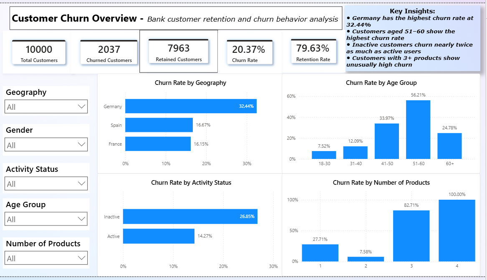
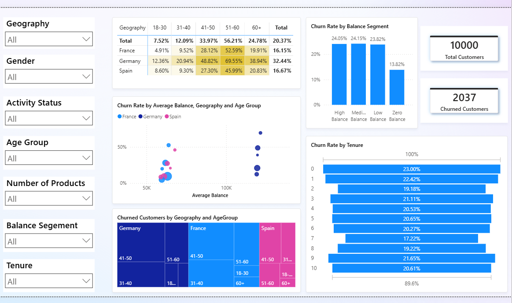
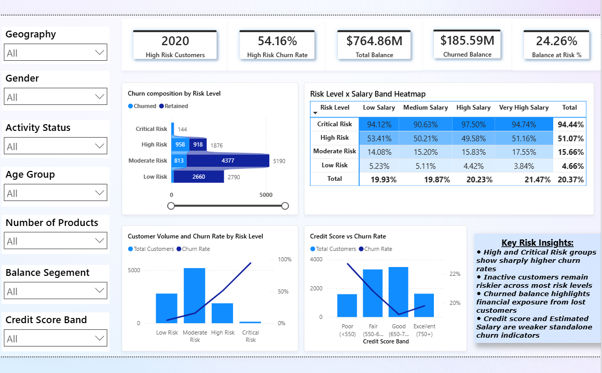
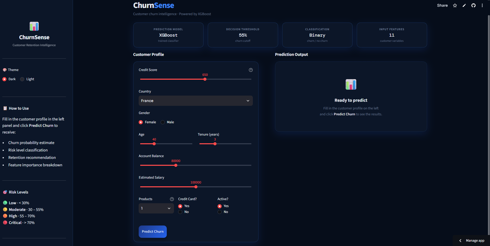
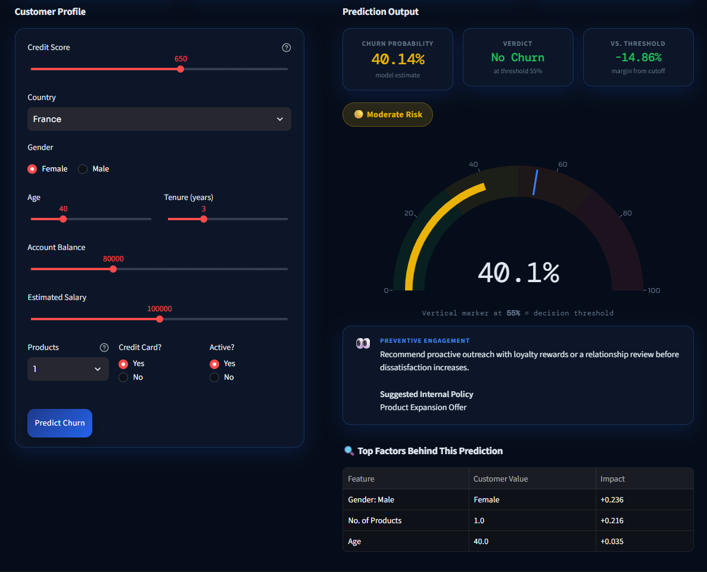
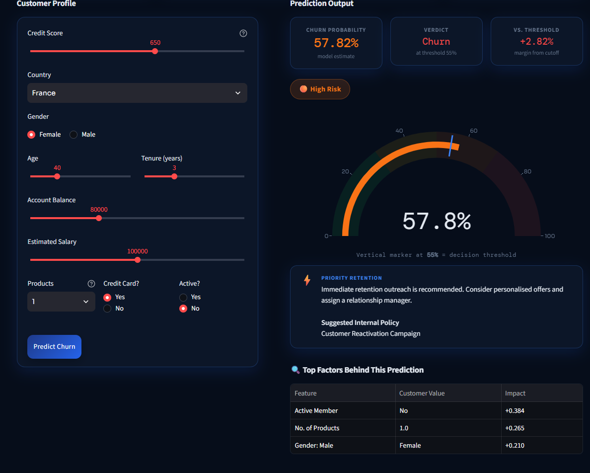
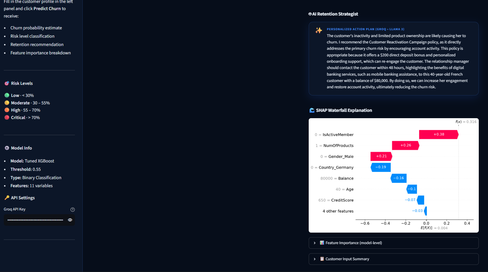

# ChurnSense AI
### End-to-End Customer Churn Prediction & AI-Powered Retention Strategy Generation


---

## Overview

Customer churn is one of the most significant business challenges faced by banks and subscription-based organizations. While traditional machine learning models can accurately identify customers who are likely to leave, they do not explain **why** the customer is at risk or **what actions** should be taken to retain them.

**ChurnSense AI** addresses this problem by combining **Machine Learning**, **Explainable AI (SHAP)**, and **Retrieval-Augmented Generation (RAG)** into a unified decision-support system.

The application predicts the probability of customer churn, identifies the primary factors influencing that prediction using SHAP values, retrieves relevant internal retention policies, and generates personalized, policy-grounded retention strategies using a Large Language Model.

The project also includes SQL-based business analytics, Power BI dashboards, an interactive Streamlit application, and a complete evaluation framework for assessing the quality of AI-generated recommendations.

---

# Project Objectives

- Predict customer churn using supervised machine learning.
- Identify key churn drivers through Explainable AI (SHAP).
- Analyze customer behavior using SQL and Python.
- Build interactive business dashboards using Power BI.
- Generate personalized retention strategies using Retrieval-Augmented Generation (RAG).
- Evaluate generated recommendations using an automated LLM-as-a-Judge framework.
- Deploy an end-to-end interactive decision-support application.

---

# Key Features

- Customer churn prediction using **Tuned XGBoost**
- Explainable AI with **SHAP**
- SQL-based customer analytics
- Interactive Power BI dashboard
- Retrieval-Augmented Generation (RAG)
- Policy-aware retention recommendations
- Groq Llama-3.3-70B integration
- Streamlit web application
- Automated RAG evaluation framework
- End-to-end deployment-ready pipeline

---

# Tech Stack

| Category | Technologies |
|-----------|--------------|
| Programming | Python, SQL |
| Data Analysis | Pandas, NumPy |
| Visualization | Matplotlib, Seaborn, Plotly |
| Dashboard | Power BI |
| Machine Learning | Scikit-learn, XGBoost |
| Explainability | SHAP |
| Generative AI | Groq API, Llama-3.3-70B |
| RAG | Custom Policy Retriever |
| Backend | FastAPI |
| Frontend | Streamlit |

---

# End-to-End Workflow

```

Customer Dataset
        │
        ▼
Data Cleaning & Preprocessing
        │
        ▼
SQL Business Analytics
        │
        ▼
Power BI Dashboard
        │
        ▼
Feature Engineering
        │
        ▼
Tuned XGBoost Model
        │
        ▼
SHAP Explainability
        │
        ▼
Top Churn Drivers
        │
        ▼
Policy Retrieval (RAG)
        │
        ▼
Groq Llama-3.3-70B
        │
        ▼
Personalized Retention Strategy

```

---

# Project Modules

## 1. Data Engineering
- Data cleaning and preprocessing
- Feature engineering
- Missing value handling
- Encoding and transformation

## 2. Business Analytics
- SQL-based customer analysis
- Customer segmentation
- Churn trend analysis
- Power BI dashboards

## 3. Predictive Analytics
- Multiple XGBoost experiments
- Hyperparameter tuning
- Threshold optimization
- Class imbalance handling

## 4. Explainable AI
- SHAP global feature importance
- SHAP local explanations
- Individual customer risk analysis

## 5. Generative AI
- Retrieval-Augmented Generation (RAG)
- Internal bank policy retrieval
- Personalized retention strategy generation
- Hallucination reduction using grounded context

## 6. Evaluation
- Automated LLM-as-a-Judge evaluation
- Relevance assessment
- Faithfulness verification
- Groundedness checking
- Personalization scoring
- Helpfulness evaluation

---
# Dataset

The project uses the **Bank Customer Churn Prediction** dataset, containing demographic, financial, and account activity information of bank customers.

### Dataset Summary

| Attribute | Value |
|-----------|------:|
| Total Customers | 10,000 |
| Features | 10 Predictive Features |
| Target Variable | Exited |
| Churn Rate | **20.37%** |
| Problem Type | Binary Classification |

### Input Features

| Feature | Description |
|----------|-------------|
| CreditScore | Customer credit score |
| Country | Customer location |
| Gender | Male/Female |
| Age | Customer age |
| Tenure | Years with the bank |
| Balance | Current account balance |
| NumOfProducts | Number of bank products |
| HasCrCard | Credit card ownership |
| IsActiveMember | Customer activity status |
| EstimatedSalary | Estimated annual salary |

**Target Variable**

- **Exited = 1** → Customer churned
- **Exited = 0** → Customer retained

---

# Data Cleaning & Preprocessing

A structured preprocessing pipeline was developed before model training to ensure data quality and consistency.

### Data Preparation Steps

- Removed duplicate records.
- Validated missing values.
- Verified data consistency across all features.
- Corrected categorical data types.
- Applied One-Hot Encoding for categorical variables.
- Preserved numerical feature distributions without unnecessary scaling (tree-based models).
- Built a reusable preprocessing pipeline for inference and deployment.

### Feature Engineering

The final model used the following transformed feature space:

- Numerical Features
  - CreditScore
  - Age
  - Tenure
  - Balance
  - NumOfProducts
  - HasCrCard
  - IsActiveMember
  - EstimatedSalary

- Encoded Features
  - Geography
  - Gender

The preprocessing pipeline was reused during both training and real-time prediction to ensure consistency between development and deployment.

---

# SQL Business Analytics

SQL was used to perform exploratory business analysis before building the predictive model.

The objective was to identify customer segments with elevated churn risk and understand behavioral patterns influencing customer retention.

### SQL Analysis Covered

- Overall churn analysis
- Country-wise churn comparison
- Gender-wise churn analysis
- Age group segmentation
- Product usage analysis
- Customer activity analysis
- Credit score segmentation
- Balance distribution
- Tenure analysis
- High-value customer identification

These SQL queries served as the foundation for understanding business behavior before applying machine learning.

---

# Exploratory Data Analysis (Python)

Python-based exploratory data analysis was performed using Pandas, Matplotlib, Seaborn, and Plotly to validate SQL findings and identify additional relationships between customer attributes and churn.

The analysis focused on discovering trends, correlations, and high-risk customer segments that could improve feature selection and model performance.

---

# Key Business Insights

The exploratory analysis revealed several important customer retention patterns.

### Customer Churn

- Overall churn rate was **20.37%**, indicating a moderately imbalanced classification problem.

### Geography

- Customers from **Germany** exhibited the highest churn rate among all regions.

### Customer Activity

- Inactive customers were significantly more likely to churn than active customers.

### Age

- Customers in the **51–60** age group showed the highest churn tendency.

### Product Usage

- Customers owning **more than two banking products** demonstrated unusually high churn rates, indicating possible customer dissatisfaction despite higher product adoption.

### Balance

- Customers maintaining higher account balances showed greater churn risk, emphasizing the importance of proactive retention strategies for high-value clients.

### Credit Score

- Credit score alone was not a dominant indicator of churn, suggesting that behavioral variables contributed more strongly to prediction performance.

These insights guided both the machine learning feature engineering process and the design of personalized retention strategies generated by the RAG system.

---
# Power BI Dashboard

An interactive Power BI dashboard was developed to transform raw customer data into business-ready insights for decision-makers.

The dashboard consists of three analytical pages covering customer distribution, churn segmentation, and risk analysis.

### Dashboard Highlights

- Customer demographic analysis
- Country-wise churn comparison
- Product usage trends
- Customer activity analysis
- Age segmentation
- Balance distribution
- Churn KPIs
- Interactive filtering and drill-down

## Dashboard Preview

### Customer Overview



---

### Customer Segmentation



---

### Risk Analysis



---

# Machine Learning Pipeline

After completing business analysis, multiple XGBoost variants were developed and compared to identify the best-performing model for customer churn prediction.

The objective was not to maximize overall accuracy, but to maximize the identification of customers at risk of churn while maintaining strong ranking capability.

---

# Model Development Process

```

Baseline Model
        │
        ▼
Weighted XGBoost
        │
        ▼
SMOTE XGBoost
        │
        ▼
Hyperparameter Tuning
        │
        ▼
Threshold Optimization
        │
        ▼
Final Tuned XGBoost

```

---

# Model Comparison

| Model | Accuracy | Precision | Recall | F1 Score | ROC-AUC |
|------|---------:|---------:|--------:|---------:|---------:|
| Baseline XGBoost | **0.8490** | **0.6829** | 0.4816 | 0.5648 | 0.8328 |
| Weighted XGBoost | 0.8225 | 0.5575 | 0.6192 | 0.5867 | 0.8358 |
| SMOTE XGBoost | 0.8170 | 0.5433 | 0.6314 | 0.5841 | 0.8282 |
| **Tuned XGBoost** | 0.8020 | 0.5093 | **0.7371** | **0.6024** | **0.8626** |

---

# Final Production Model

Although the baseline model achieved higher overall accuracy and precision, it failed to identify a large proportion of customers who were actually at risk of churn.

For customer retention systems, missing an at-risk customer is significantly more expensive than investigating a false positive. Therefore, recall and ranking capability were prioritized during model selection.

The **Tuned XGBoost** model was selected as the production model because it achieved:

- Highest **ROC-AUC (0.8626)**
- Highest **Recall (73.71%)**
- Best overall **F1 Score**
- Better balance between precision and recall
- Stronger customer ranking capability for retention campaigns

---

# Threshold Optimization

Instead of using the default decision threshold of **0.50**, threshold optimization was performed to improve the trade-off between precision and recall.

| Parameter | Value |
|-----------|------:|
| Model | Tuned XGBoost |
| Decision Threshold | **0.55** |
| Class Imbalance Handling | scale_pos_weight |

Final production performance after threshold optimization:

| Metric | Score |
|---------|------:|
| Precision | **0.5424** |
| Recall | **0.7076** |
| F1 Score | **0.6141** |
| ROC-AUC | **0.8626** |

This threshold provided a more practical balance between identifying churners and limiting false alarms in a real-world banking environment.

---

# Explainable AI (SHAP)

To improve model transparency, SHAP (SHapley Additive Explanations) was integrated into the prediction pipeline.

Instead of treating the model as a black box, SHAP explains the contribution of every feature toward an individual customer's churn prediction.

For every prediction, the application identifies the strongest positive churn drivers and uses these explanations as contextual input for the RAG-based recommendation engine.

### SHAP Benefits

- Global feature importance
- Local customer-level explanations
- Transparent decision-making
- Explainable retention recommendations
- Human-readable risk interpretation

The extracted SHAP drivers are passed directly into the Retrieval-Augmented Generation pipeline, allowing the language model to generate recommendations based on the actual reasons behind customer churn rather than generic advice.

---
# AI-Powered Retention Strategy Generation (RAG)

Traditional churn prediction models stop after identifying whether a customer is likely to churn. ChurnSense AI extends this workflow by automatically generating personalized, business-aware retention recommendations using a Retrieval-Augmented Generation (RAG) pipeline.

Instead of producing generic suggestions, the system combines customer information, model explanations, and internal banking policies to generate actionable strategies that are both personalized and grounded in business knowledge.

---

# RAG Workflow

```

Customer Information
        │
        ▼
Tuned XGBoost Prediction
        │
        ▼
SHAP Explanation
        │
        ▼
Top Churn Drivers
        │
        ▼
Policy Retrieval
        │
        ▼
Prompt Construction
        │
        ▼
Groq Llama-3.3-70B
        │
        ▼
Personalized Retention Strategy

```

---

# Knowledge Base

A structured internal policy knowledge base was developed to simulate business retention guidelines followed by financial institutions.

The knowledge base contains retention policies mapped to different customer risk profiles, including:

- High-value customer retention
- Product upgrade recommendations
- Customer loyalty rewards
- Personalized interest rate offers
- Premium banking services
- Customer engagement campaigns
- Balance protection strategies
- Multi-product relationship incentives

Rather than relying solely on the language model's internal knowledge, these policies are retrieved dynamically during inference to ensure consistent and business-aligned recommendations.

---

# Policy Retrieval

The retrieval component selects the most relevant retention policies based on customer attributes and churn drivers identified by SHAP.

The retrieval process considers information such as:

- Customer age
- Geography
- Product ownership
- Account balance
- Customer activity
- Credit profile
- SHAP feature importance

Only the most relevant policies are included in the final prompt sent to the language model.

This approach significantly reduces hallucinations while ensuring generated recommendations remain aligned with organizational policies.

---

# Prompt Engineering

The prompt supplied to the language model contains four primary components:

1. Customer Profile
2. Churn Probability
3. Top SHAP Risk Drivers
4. Retrieved Retention Policies

The model is instructed to:

- Explain the customer's churn risk.
- Recommend personalized retention actions.
- Use only the supplied business policies.
- Avoid unsupported recommendations.
- Produce concise and manager-friendly output.

---

# Large Language Model

| Component | Technology |
|------------|------------|
| Provider | Groq |
| Model | Llama-3.3-70B-Versatile |
| Framework | Retrieval-Augmented Generation (RAG) |

The LLM does not independently invent retention strategies. Instead, it generates responses using the retrieved business policies and customer-specific context, producing recommendations that are both personalized and grounded.

---

# Streamlit Application

An interactive Streamlit application was developed to demonstrate the complete end-to-end pipeline.

### Application Features

- Customer information input
- Real-time churn prediction
- Churn probability visualization
- SHAP explanation
- Retrieved policy display
- AI-generated retention strategy
- Business-ready user interface

## Application Preview






---

# FastAPI Backend

The project also includes a FastAPI backend for serving machine learning predictions and enabling future integration with external applications.

The backend supports:

- Customer prediction endpoint
- Model inference
- Feature preprocessing
- JSON-based API communication
- Easy deployment for production environments

---

# End-to-End Intelligent Decision Pipeline

Unlike traditional churn prediction systems that stop after generating a probability score, ChurnSense AI provides a complete decision-support workflow.

```

Customer Data
      │
      ▼
Data Preprocessing
      │
      ▼
Tuned XGBoost Prediction
      │
      ▼
SHAP Explainability
      │
      ▼
Top Risk Factors
      │
      ▼
Policy Retrieval
      │
      ▼
Groq Llama-3.3-70B
      │
      ▼
Personalized Retention Recommendation
      │
      ▼
Business Decision Support

```

This integrated workflow transforms churn prediction into an explainable, actionable, and AI-assisted customer retention system.

---
---

# Retrieval-Augmented Generation (RAG) Pipeline

Instead of generating generic retention advice, ChurnSense retrieves relevant bank retention policies before prompting the LLM. This ensures recommendations remain grounded in organizational guidelines.

### RAG Workflow

```
Customer Profile
       │
       ▼
Preprocessing
       │
       ▼
XGBoost Prediction
       │
       ▼
SHAP Feature Importance
       │
       ▼
Policy Retrieval
       │
       ▼
LLM (Llama-3.3-70B via Groq)
       │
       ▼
Personalized Retention Strategy
```

### Knowledge Base

The retrieval system contains curated retention policies such as:

- High Balance Retention
- Senior Citizen Benefits
- Multi-Product Cross-selling
- Loyalty Rewards
- Salary Account Benefits
- Credit Card Incentives
- Premium Relationship Banking
- Digital Banking Adoption
- Customer Engagement Programs

The retrieved policies are injected into the LLM prompt to minimize hallucination and produce policy-grounded responses.

---

# LLM Evaluation Framework

The generated retention strategies were evaluated using an automated **LLM-as-a-Judge** framework.

Each generated response was scored across five dimensions:

| Metric | Description |
|---------|-------------|
| Relevance | Response addresses the customer's actual churn drivers |
| Groundedness | Recommendation is supported by retrieved policies |
| Faithfulness | No hallucinated information beyond provided context |
| Personalization | Advice is tailored to the individual customer |
| Helpfulness | Practical usefulness for retention managers |

Evaluation was performed on **70 representative customer profiles** covering diverse churn scenarios.

---

# RAG Evaluation Results

| Metric | Average Score |
|---------|--------------:|
| Relevance | **4.76 / 5** |
| Groundedness | **4.99 / 5** |
| Faithfulness | **4.97 / 5** |
| Personalization | **4.91 / 5** |
| Helpfulness | **4.94 / 5** |

### Generation Performance

- Total evaluated customers: **70**
- Average judging latency: **~1.45 seconds**
- Initial requests averaged under **500 ms**
- Later requests averaged **~2.5 seconds** due to API/network latency

The evaluation demonstrates that the generated retention strategies are highly relevant, grounded in retrieved policies, and consistently faithful to the provided customer context.

---

# Streamlit Application

The application provides an end-to-end interface for customer churn analysis.

### Features

- Customer information input
- Real-time churn probability prediction
- Risk categorization
- SHAP-based explainability
- Retrieved retention policies
- AI-generated personalized retention strategy

---

# Project Structure

```text
ChurnSense/
│
├── app/
│   ├── app_standalone.py
│   ├── main.py
│   └── artifacts/
│
│
├── data/
│   ├── bank_churn_cleaned.csv
│   ├── rag_eval_dataset.csv
│   └── policy_knowledge_base.csv
│
├── dashboard/
│   └── Customer_Churn_Dashboard.pbix
│
├── notebooks/
│   ├── churn_eda_ml_analysis.ipynb
│   └── final_model_training.ipynb
│
├── sql/
│   └── churn_analysis.sql
│
├── images/
│   ├── dashboard_p1_overview.png
│   ├── dashboard_p2_segmentation.png
│   ├── dashboard_p3_risk_analysis.png
│   ├── streamlit_app.png
│   ├── streamlit_app_1.png
│   ├── streamlit_app_2.png
│   └── streamlit_app_3.png
│
├── rag_generation_evaluator.py
├── rag_judge_evaluator.py
├── requirements.txt
└── README.md
```

---

# How to Run

## Clone Repository

```bash
git clone https://github.com/<your-username>/ChurnSense.git

cd ChurnSense
```

---

## Install Dependencies

```bash
pip install -r requirements.txt
```

---

## Configure API Key

Create a `.env` file.

```text
GROQ_API_KEY=YOUR_API_KEY
```

---

## Run Streamlit

```bash
streamlit run app/app_standalone.py
```

---

## Future Improvements

- Hybrid Retrieval using Vector Database
- Semantic Search with Embeddings
- Multi-turn conversational assistant
- Continuous policy updates
- Customer feedback loop for recommendation refinement
- Production deployment using Docker and cloud infrastructure

---

# Author

**Aashutosh Pathak**

B.Tech Chemical Engineering  
Motilal Nehru National Institute of Technology Allahabad

Interested in:

- Machine Learning
- Generative AI
- NLP
- Data Science
- Explainable AI

---